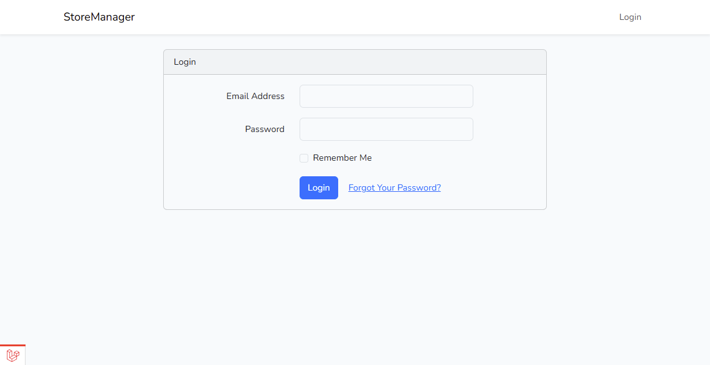
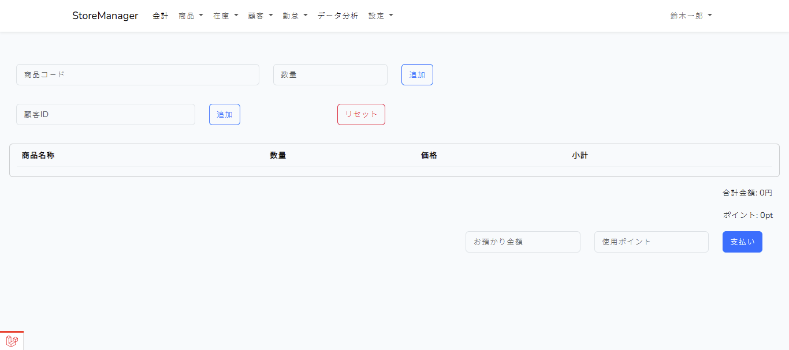
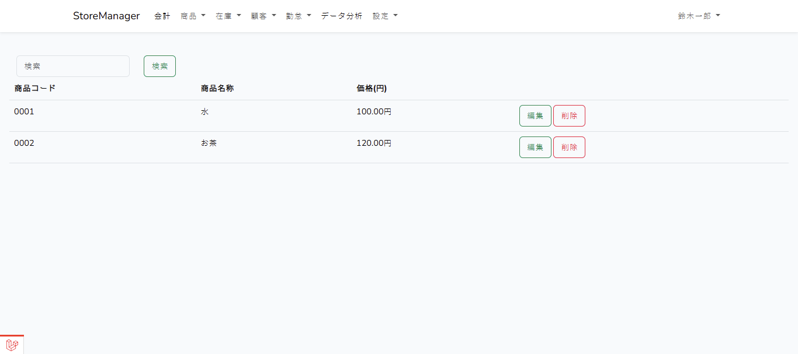
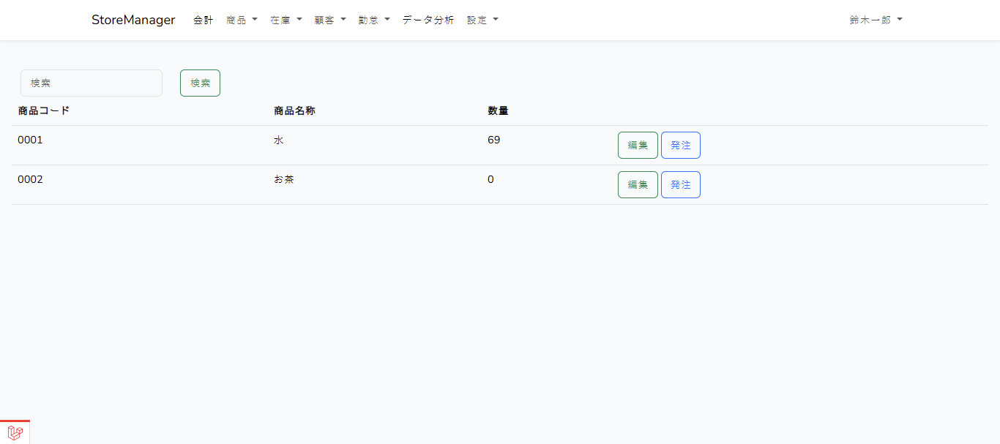
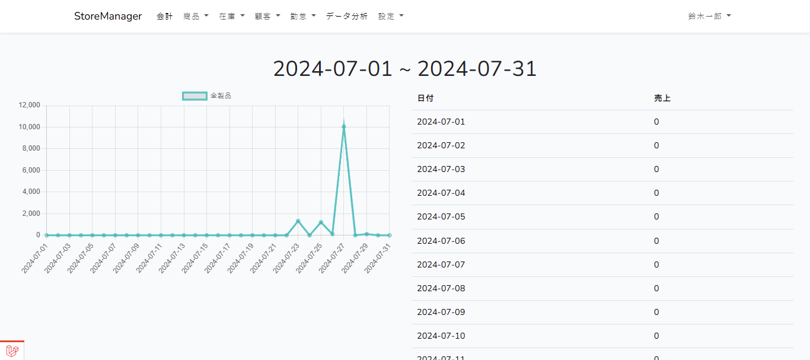

# StoreManager

## StoreManager
`StoreManager` は Laravel を使用したストア管理システムです。  
商品管理、注文管理、ユーザー管理などの機能を備えたシンプルなウェブアプリケーションです。

---

## 機能一覧
- **ユーザー管理**（ログイン・登録・認証）
- **商品管理**（商品登録・編集・削除）
- **在庫管理**（在庫の閲覧・更新）
- **ダッシュボード**（管理者向け統計情報）

---

## 使用技術
- **バックエンド**: Laravel 11
- **データベース**: MySQL
- **フロントエンド**: Blade, Bootstrap
- **認証**: Laravel Auth
- **環境変数管理**: `.env`

---

## スクリーンショット

### ログインページ
ユーザーが認証情報を入力してシステムにログインする画面です。

### 会計画面
商品の販売処理を行うためのインターフェースです。

### 商品画面
新しい商品を登録・編集する画面です。

### 在庫画面
倉庫の在庫数を確認し、必要に応じて補充を行う画面です。

### 統計画面
売上を確認するためのダッシュボードです。

---

